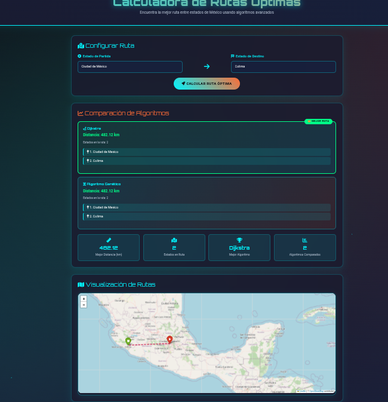

# 🗺️ Calculadora de Rutas Óptimas en México

[](https://python.org)
[](https://flask.palletsprojects.com/)
[](LICENSE)

## 📋 Descripción

**Calculadora de Rutas Óptimas** es una aplicación web diseñada para encontrar las rutas más cortas entre estados de México utilizando algoritmos avanzados como **Dijkstra** y **Algoritmos Genéticos**. La aplicación permite a los usuarios seleccionar un estado de partida y un estado de destino, calcular la distancia óptima y visualizar los resultados en un mapa interactivo generado con Folium y Leaflet.

La interfaz cuenta con un diseño futurista con efectos visuales, animaciones y un estilo responsivo, asegurando una experiencia de usuario atractiva y funcional.

## 🖼️ Vista del Proyecto


<!-- Para agregar una imagen, súbela a tu repositorio y reemplaza "ruta/a/tu/imagen.png" con la ruta real -->

## ✨ Características

- 🔍 **Cálculo de Rutas**: Calcula rutas óptimas entre estados mexicanos usando Dijkstra y Algoritmos Genéticos
- 🗺️ **Visualización de Mapas**: Muestra las rutas en un mapa interactivo con Leaflet
- ⚡ **Comparación de Algoritmos**: Compara el rendimiento de ambos algoritmos, destacando la mejor ruta
- 🎨 **Interfaz Futurista**: Diseño moderno con animaciones, efectos de partículas y estilo de vidrio esmerilado
- ✅ **Validaciones en Tiempo Real**: Evita errores como seleccionar el mismo estado para partida y destino
- 📤 **Exportación y Compartición**: Permite exportar resultados en JSON y compartirlos

## 🛠️ Tecnologías Utilizadas

### Backend
- **Python 3.8+**
- **Flask** - Framework web
- **Folium** - Mapas interactivos
- **Requests** - Consultas a APIs externas

### Frontend
- **HTML5, CSS3, JavaScript**
- **Bootstrap 5.3** - Framework CSS
- **Leaflet 1.9.3** - Mapas interactivos
- **Font Awesome 6.4** - Iconos
- **Google Fonts** (Orbitron, Roboto)

### Datos
- Coordenadas geográficas de los estados de México en `coordenadas.json`

## 📁 Estructura del Proyecto

```
rutas_optimas/
├── ruta/
│   └── coordenadas.json       # Coordenadas geográficas de los estados
├── static/
│   ├── js/
│   │   └── script.js          # Lógica JavaScript del frontend
│   └── ruta_interactiva.html  # Mapa interactivo generado por Folium
├── templates/
│   └── index.html             # Plantilla principal de la interfaz
└── prueba3.py                 # Código principal del backend (Flask)
```

## 🚀 Instalación

### Prerrequisitos
- Python 3.8 o superior
- pip (gestor de paquetes de Python)

### Pasos de instalación

1. **Clona el repositorio:**
   ```bash
   git clone https://github.com/FERNANDOANGEL202123767/rutas_optimas.git
   cd rutas_optimas
   ```

2. **Crea un entorno virtual (recomendado):**
   ```bash
   python -m venv venv
   source venv/bin/activate  # En Windows: venv\Scripts\activate
   ```

3. **Instala las dependencias:**
   ```bash
   pip install flask folium requests
   ```

4. **Configura la API Key (opcional):**
   - La aplicación incluye un fallback usando la fórmula de Haversine
   - Para Google Maps: obtén una clave de Google Cloud Console
   - Alternativa recomendada: OpenRouteService (gratuito)

5. **Ejecuta la aplicación:**
   ```bash
   python prueba3.py
   ```

6. **Abre tu navegador en:** `http://localhost:5000`

## 📖 Uso

1. **Selecciona los estados:** Usa los menús desplegables para elegir origen y destino
2. **Calcula la ruta:** Haz clic en "Calcular Ruta Óptima"
3. **Visualiza los resultados:** Compara algoritmos y revisa estadísticas
4. **Explora el mapa:** Visualiza la ruta en el mapa interactivo
5. **Exporta o comparte:** Descarga en JSON o comparte los resultados

## 🔑 Notas sobre API Key

- **Fallback incluido:** Usa la fórmula de Haversine si no hay API configurada
- **Google Maps:** Requiere cuenta de facturación y configuración de restricciones
- **OpenRouteService:** Alternativa gratuita recomendada (ver código comentado)

## 🤝 Contribuir

¡Las contribuciones son bienvenidas! Para contribuir:

1. Haz fork del repositorio
2. Crea una nueva rama (`git checkout -b feature/nueva-funcionalidad`)
3. Realiza tus cambios y haz commit (`git commit -m "Añadir nueva funcionalidad"`)
4. Sube los cambios (`git push origin feature/nueva-funcionalidad`)
5. Abre un Pull Request

Asegúrate de seguir las convenciones de PEP 8 para Python.

## 📄 Licencia

Este proyecto está bajo la [Licencia MIT](LICENSE).

## 📧 Contacto

**GitHub:** [FERNANDOANGEL202123767](https://github.com/FERNANDOANGEL202123767)

---

🌟 **¡Explora México con la ruta más eficiente!** 🌟
